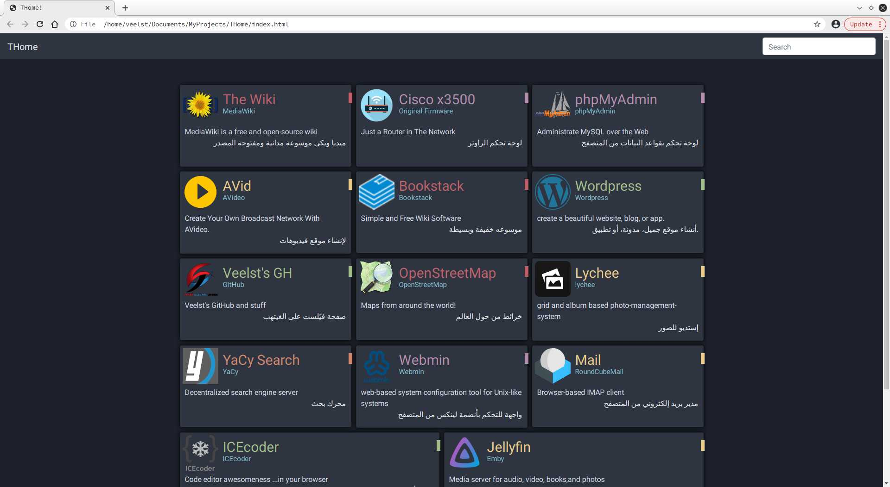
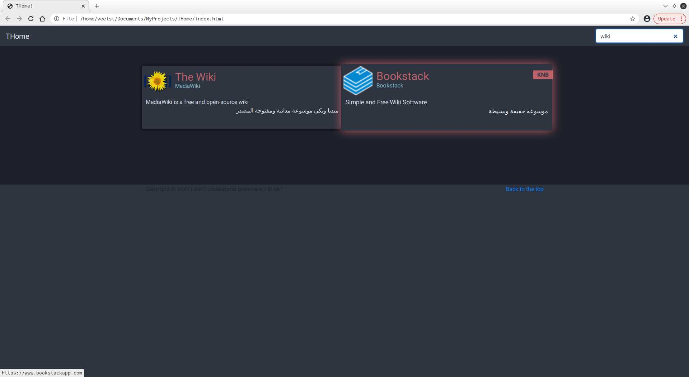
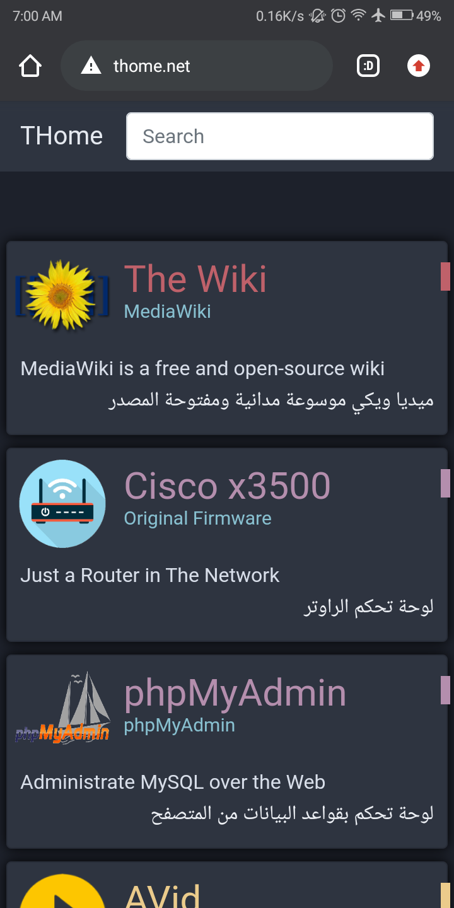

# THome
THome is a static minimal personal dashboard made for local use, except its a bit easier to maintain and update it using python

I just wanted to make my own dashboard for my homelab and used the things i know to put it together as simple as i can

# Features
- simple design
- responsive, works great on PC, tablet and phone
- doesn't require any special dependencies, for linux at least
- has search to filter your cards
- works fast and perfectly without internet, since all the css and js are attached

# Screenshots




# requirement
- A Text Editor
- Python
- Web Browser

# How to use
- First of edit the sites.xml, change every thing in CAPS, add as many as you like
```
<item name = "NAME">
    <tag>TAG</tag>
    <tag_text>SHORT_TAG</tag_text>
    <name>NAME</name>
    <link>HTTPS://LINK.COM</link>
    <image_name>FILENAME.PNG</image_name>
    <powered_by>NAME</powered_by>
    <description_en>TEXT</description_en>
    <description_ar>نص</description_ar>
</item>
```

- for <tag> use or however you like (this affect the colors of the cards):
    - "KB" Stands for: Knowledge Base and Wikis
    - "SaM" Stands for: Social networks and media
    - "WaB" Stands for: Websites and Blogs
    - "SaI" Stands for: Search and Indexing
    - "admin" Stands for: Admin tools and such

- Run the python script to create your index.html
    `python main.py`

- put the files in your webserver or just open it in your web browser

# Used stuff
things used here:
- HTML
- CSS
- Bootstrap & jQuery
- [This script for the search](https://stackoverflow.com/a/61621522)
- Nord Colors
- Python
